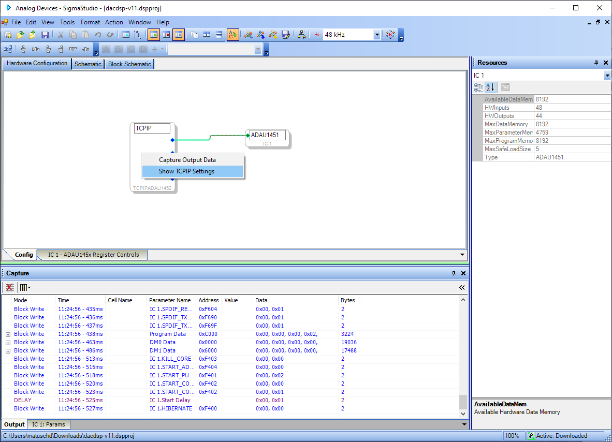
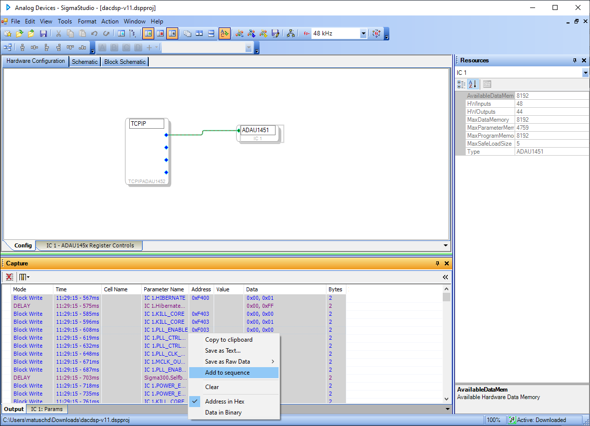

# Adapting existing profiles

While we provide pre-configured profiles, you might want to add more functionalities or simply remove some blocks. 
This document shows how this can be done easily. It's recommended to start with a working project as creating one from scratch can
be quite complicated.

## Open and edit the project

## Connect to the Pi

In the Hardware configuration/TCPIP block, right click and set the IP address of your Pi. Then press "Open connection"

## Test

Use the Action/Link Compile Download menu to push the DSP program to the Pi. 

## Create a DSP profile

### Write to EEPROM

First, make sure that the "Capture" window is empty. If it's not, press "Clear all output data".
Now right-click on the ADAUxxxx component and select "Self-Boot Memory/Write latest compilation through DSP"

This will take some time. All communication with the DSP is being recorded in the Capture windows. Now select all entries in the Capture window and select "Add to Sequence".

